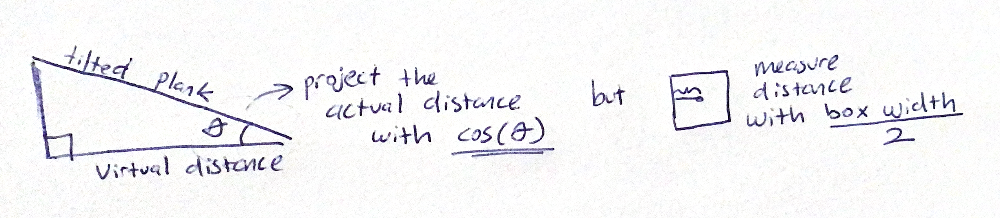

# Seesaw Simulator

A lightweight physics-driven interactive simulator made with HTML, CSS, and JavaScript.

Click on the seesaw plank to drop weighted boxes and watch how torque, gravity, and mass distribution affect the motion in real time.

## Features

- Real-time seesaw rotation driven by physics formulas
- Randomized weight blocks (1–10 kg) with dynamic torque contribution
- Smooth animation loop with damping and angle limits
- Responsive click-to-place interaction
- GitHub-themed visual design and subtle UI animations
- Sound effects for placing boxes and resetting simulation

## Thought Process & Physics Design

### 1. Frame-by-frame reasoning

I designed the system by thinking in terms of “what happens in real physics during each frame?” and this led to identifying the exact forces and formulas I need:

- Net torque
- Moment of inertia
- Angular acceleration
- Angular velocity
- Damping (energy loss)
- Angle constraints and bounce behavior

The simulation loop (`animate()`) simply recalculates the physics every frame, which keeps the behavior physically coherent.

### 2. Real physics formulas used

#### Torque:

```
torque = mass × gravity × distanceFromCenter
```

#### Moment of Inertia

```
I = Σ mass × distance²  +  baseInertia
```

A base inertia term (5002) stabilizes the seesaw and avoids chaotic motion with light weights.

#### Angular Acceleration

```
α = netTorque / momentOfInertia
```

#### Angular Velocity & Damping

```
ω += α
ω *= damping
angle += ω
```

All of this logic lives inside `updateRotation()` in `script.js`, which is the core of the simulation.

### 3. Accurate projection of click position on a rotated seesaw



Even when the seesaw rotates, clicking on it places objects at the correct real-world distance from the center. This is achieved by projecting the screen distance onto the rotated surface:

```
relativeDistance = (mouseX - screenCenter) / cos(angle)
```

This ensures dropping a box where you intended always works. Also ensures that gravity and mass distribution remain physically meaningful.

## Trade-offs & Limitations

### 1. No global 2D gravity field

Originally, I intended to model a universal downward gravity vector and let the seesaw behave within a bigger physical world.

However:

- No physics engine
- No rigid-body collision system
- No world-space gravity simulation

Given the minimal codebase and zero external frameworks, I chose a simpler and more efficient model:

- Only rotational gravity effects (torque)
- Pivot-locked seesaw
- Boxes do not slide along the plank

I determined that this was the most correct approach without building a full physics engine from scratch.

### 2. Boxes do not roll or slide

Boxes stick to where they land. This keeps the simulation stable and avoids implementing friction, surface forces, and object-to-object collisions.

### 3. Aesthetic rather than hyper-realistic

The motion is realistic but slightly stylized:

- Angle capped to ±30° (as determined inside the requirements)
- Damped oscillations
- Slight bounce at max tilt

This makes the sandbox fun and readable rather than aggressively physical.

## AI Assistance Disclosure

Certain parts of this project were assisted by AI tools:

- Refining UI theme ideas and color alignment
- Explaining physics concepts in simpler language during research
- Generating consistent wording and summarization for README
- Minor syntax refactoring suggestions for readability
- Quick visual styling guidance (but manually applied by me)

## Running and Testing

The live version of the project is available here:
https://emirariemir.github.io/seesaw-simulator/
